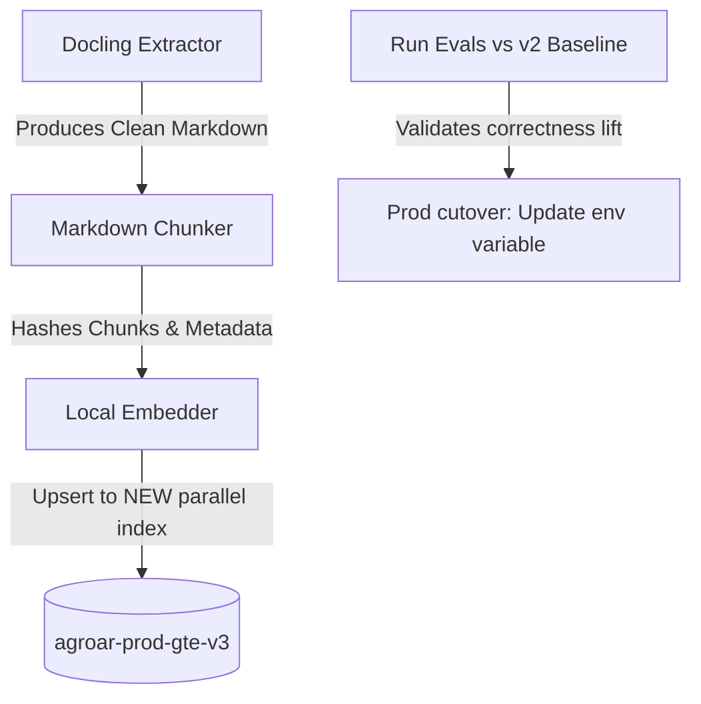

# Docling Parser Migration Plan

This plan outlines the architecture, implementation steps, and safety constraints for replacing our legacy PDF extraction stack (PyMuPDF + Camelot) with IBM's open-source **Docling** library to improve reading order, structure, and table extraction.

---

## 1. Architectural Impact & Existing Vector Strategy

Since we already have an operational vector database (`agroar-prod-gte-v2`) and cached metadata, we must execute this change **without clobbering or degrading the live service**.



### A. Existing Vectors and Hashes
*   **Chunk Re-segmentation:** Because Docling parses document layout differently and outputs Markdown rather than raw lines, the chunk boundaries and text content will change. Deterministic chunk hashes (IDs) will not align with those in the `v2` index.
*   **Parallel Index Strategy:** We will **never** write Docling chunks to `agroar-prod-gte-v2`. Instead, we will configure the pipeline to build a new index `agroar-prod-gte-v3` (or use a dedicated namespace). This ensures the live app is completely unaffected during indexing and local testing.
*   **Index Cutover:** The cutover to the Docling-parsed index is a simple env var update on our Hugging Face Space: `PINECONE_INDEX_NAME=agroar-prod-gte-v3`. If any unforeseen issues arise, roll back is instantaneous.

### B. Dependency Check
*   Docling uses PyTorch for its deep learning layout and table recognition models. Since our backend already imports `sentence-transformers` (which installs PyTorch), adding `docling` will not introduce major library conflicts, but we must verify dependency sizes on Hugging Face's ephemeral disk.

---

## 2. Proposed Changes

### [Component: Ingestion Pipeline]

#### [MODIFY] [requirements.txt](file:///c:/Users/jeged/Downloads/AgroAdvisor/ingestion/requirements.txt)
*   Add `docling>=2.0.0` to the ingestion requirements.

#### [MODIFY] [extractor.py](file:///c:/Users/jeged/Downloads/AgroAdvisor/ingestion/extractor.py)
*   Replace PyMuPDF (`fitz`) and `camelot` imports with `docling.document_converter.DocumentConverter`.
*   Rewrite `extract_text(pdf_path)` to return the converted Markdown string.
*   Retain function signatures so `pipeline.py` and `ingest_en_gte.py` can import it without regressions.

#### [MODIFY] [chunker.py](file:///c:/Users/jeged/Downloads/AgroAdvisor/ingestion/chunker.py)
*   Replace `RecursiveCharacterTextSplitter` with a layout-aware markdown splitter.
*   Ensure markdown tables (pipe-delimited blocks `|`) are kept intact in a single chunk to prevent parsing loss.
*   Ensure standard metadata (`document_title`, `section_heading`, `crop_type`) is correctly populated from headers.

#### [MODIFY] [pipeline.py](file:///c:/Users/jeged/Downloads/AgroAdvisor/ingestion/pipeline.py)
*   Target the new index `agroar-prod-gte-v3` as default or configure via `--index` flag.

---

## 3. Verification & Evaluation Plan

### Step 1: Ingestion Dry-Run
Index a sample PDF locally (e.g. `rice_2026_arkansas_rice_quick_facts.pdf`) into a test index/namespace.
Check that the document layout, tables, and sections are correctly converted to Markdown and chunked without text interleaving.

### Step 2: Diagnostic Evaluation comparison
We will evaluate the new index (`v3`) against our gold conditional set:
```bash
$env:LLM_PRIMARY="deepinfra"; $env:PINECONE_INDEX_NAME="agroar-prod-gte-v3"; python -m evals.diagnostic.runner --gold evals/diagnostic/gold_labels.jsonl
```
**Evals Target Metrics:**
*   Compare `B3` (Corpus Gap) and `B_MISS` (Retrieval Miss) counts. We expect `B_MISS` to decrease (especially for table-heavy queries) as Docling's tables are parsed into cohesive Markdown.
*   Verify that `conditional_completeness_rate` increases from the current `0.429` baseline.
*   Ensure the **Citation Guard** continues to pass (checks that cited titles match index documents).

### Step 3: Production Cutover
1. Build the full `v3` index using the Docling pipeline.
2. In the Hugging Face Space settings, update:
   `PINECONE_INDEX_NAME=agroar-prod-gte-v3`
3. Smoke-test the live app at the prod Vercel URL.
