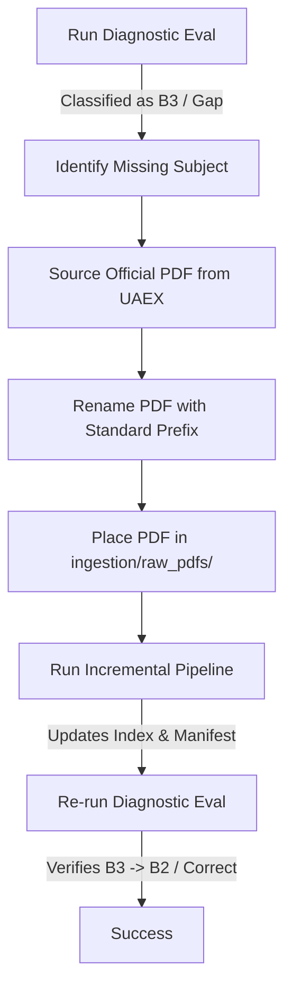

# Targeted Ingestion & Corpus Expansion Blueprint

This document details the architecture, lifecycle, and operational steps for detecting corpus gaps, sourcing official extensions, ingesting new documents into the vector database, and verifying gap closure.

---

## 1. The Corpus Expansion Lifecycle

Corpus expansion is the core mechanism for resolving **B3 (Corpus Gap)** failures, which represent queries that cannot be answered because the required information is entirely missing from the indexed documents.



---

## 2. Gap Identification Protocol

There are two primary methods for detecting gaps in the AgroAdvisor knowledge base:

### A. Automated Diagnostic Harness (D3 Gate)
Running the diagnostic runner categorizes queries into precise failure modes:
```bash
python -m evals.diagnostic.runner --gold evals/diagnostic/gold_labels.jsonl
```
*   **B3 Classification:** If a query's target document is not found in the index (`source_in_index: false` or missing chunks), the harness flags the query as `B3` (Corpus Gap).
*   **Action:** Extract the queries flagged with `B3` and locate their source material.

### B. Production Abstention / Hallucination Logs
*   Look for queries where the system outputted an abstention message (e.g. "I cannot provide an advisory for...") despite the query being in-scope.
*   Look for queries where the LLM generated an answer but the citation guard suppressed it due to zero title-overlap or low faithfulness (which occurs when retrieved context is irrelevant/empty).

---

## 3. Sourcing & Prefix Standarization

To expand the corpus, official University of Arkansas Cooperative Extension Service (UAEX) publications must be downloaded and named according to standard naming conventions.

### Standard Naming Rules
The ingestion pipeline automatically infers the target namespace from the PDF filename prefix:
*   `rice_*.pdf` $\rightarrow$ Upserted to `rice` namespace
*   `soybeans_*.pdf` $\rightarrow$ Upserted to `soybeans` namespace
*   `poultry_*.pdf` $\rightarrow$ Upserted to `poultry` namespace
*   `general_*.pdf` $\rightarrow$ Upserted to `general` namespace

> [!WARNING]
> If a file does not begin with one of these prefixes (followed by `_` or `-`), the pipeline defaults to the `general` namespace. Always rename downloaded files to match this format (e.g., `soybeans_2026_weed_guide.pdf`).

---

## 4. Ingestion Pipeline Execution

The ingestion pipeline handles extraction, table parsing, recursive chunking, embedding, and indexing.

### Core Architecture Components

1.  **Text & Table Extraction (`extractor.py`):**
    *   **IBM Docling** (subprocess-per-10-page, `do_table_structure=False`, `device="cpu"`). Produces layout-aware Markdown with reading order preserved. Tables extracted as flowing text (no TableFormer — OOM on CPU).
    *   PyMuPDF + Camelot removed 2026-06-12.
2.  **Markdown-Aware Chunking (`chunker.py`):**
    *   `MarkdownHeaderTextSplitter` (H1/H2/H3) isolates structural sections first.
    *   `RecursiveCharacterTextSplitter` (512 chars, 50 overlap) further splits large sections.
    *   Attaches deterministic SHA-256 hashes (`chunk_id`) to prevent duplicate indexing.
    *   Attaches critical metadata fields: `document_title`, `section_heading`, and `crop_type`.
3.  **Embedding and Indexing (`pipeline.py` & `embedder.py`):**
    *   Loads `thenlper/gte-base` to encode chunks into 768-dimensional vectors.
    *   Upserts vectors to the namespace specified by the filename prefix in `agroar-prod-gte-v3` (current prod; was v2 before 2026-06-12 Docling migration).

### Incremental Execution (Recommended)
To ingest only new or modified PDFs:
```bash
python ingestion/pipeline.py
```
This script checks the file hash against `ingestion/corpus_manifest.json` and skips files that are unchanged.

### Full Re-index Execution
To rebuild the entire index from scratch (or force-index all files):
```bash
python ingestion/pipeline.py --force
```
Or rebuild the `agroar-prod-gte-v2` index completely:
```bash
python ingestion/ingest_en_gte.py
```

---

## 5. Post-Ingestion Verification

After running the ingestion pipeline, verify that the gap has been successfully closed.

### Step 1: Check Corpus Manifest
Ensure `ingestion/corpus_manifest.json` has been updated with the new document name and its vector count:
```json
"soybeans_2026_weed_guide": {
  "hash": "d3b07384d113edec49eaa6238ad5ff00...",
  "vectors": 142,
  "crop_type": "soybeans"
}
```

### Step 2: Validate Pinecone Content
Use the diagnostic helper to confirm the title is indexed:
```python
from evals.diagnostic.source_index import doc_title_in_index
print(doc_title_in_index("soybeans 2026 weed guide")) # Should return True
```

### Step 3: Run Diagnostic Regression Testing
Add a test record to `evals/diagnostic/gold_labels.jsonl` representing the gap query, and run:
```bash
python -m evals.diagnostic.runner --gold evals/diagnostic/gold_labels.jsonl
```
The bucket count for `B3` should decrease, and the query should now be classified as `B2` (Answerable, Gen Failed) or transition directly to correct/faithful.
